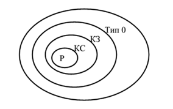

<h1 style="font-size: 50px" align="center">Лекция 1. Основные понятия теории формальных языков и 
грамматик</h1>

<h3 style="font-size: 40px" align="center">Распознавание типов формальных языков и грамматик</h3>

 <b>Определение 1.1.</b> Алфавитом V называется конечное множество символов.
 <b>Определение 1.2.</b> Цепочкой α в алфавите V называется любая конечная
последовательность символов этого алфавита.
 <b>Определение 1.3.</b> Цепочка, которая не содержит ни одного символа, 
называется пустой цепочкой и обозначается ε.
 <b>Определение 1.4.</b> Формальное определение цепочки символов в алфавите
V:
    
>
 1. ε - цепочка в алфавите V;  2. если α - цепочка в алфавите V и а – символ этого алфавита, то αа – цепочка в алфавите V; 3. β - цепочка в алфавите V тогда и только тогда, когда она является таковой в силу утверждений 1) и 2). 

 <b>Определение 1.5.</b> Длиной цепочки α называется число составляющих ее
символов (обозначается |α|).
Обозначим через V* множество, содержащее все цепочки в алфавите V,
включая пустую цепочку ε, а через $1 + 2 = 3$ - множество, содержащее все цепочки 
в алфавите V, исключая пустую цепочку ε.

 <b><u>Пример 1.1.</b></u> Пусть V = {1, 0}, тогда V* = {ε, 0,1, 00, 01,10,11, 000, K}, а
V + = {0,1, 00, 01,10,11, 000, K}.

 <b>Определение 1.6.</b> Формальной грамматикой называется четверка вида:
G = (VT, VN, P, S), (1.1)
где VN - конечное множество нетерминальных символов грамматики
(обычно прописные латинские буквы);
VT - множество терминальных символов грамматики (обычно строчные 
латинские буквы, цифры, и т.п.), VT ∩ VN = ∅;
Р – множество правил вывода грамматики, являющееся конечным
подмножеством множества (VT ∪ VN)+ × (VT ∪ VN)*; 
элемент (α, β) множества Р называется правилом вывода и записывается в 
виде α → β (читается: «из цепочки α выводится цепочка β»);
S - начальный символ грамматики, S ∈VN.

Для записи правил вывода с одинаковыми левыми частями видаα →β1,
α→β 2, K, α →β n используется сокращенная форма записи
α→β1 | β 2 |K| β n.

 <b><u>Пример 1.2.</b></u> Грамматика G1= ({0, 1}, {A, S}, P1, S), где множество Р1 состоит 
из правил вида: 1) S→ 0A1; 2) 0A→ 00A1; 3) A→ε.

<b>Определение 1.7.</b> Цепочка β ∈ (VT ∪ VN)* непосредственно выводима из
цепочки α ∈ (VT ∪VN )+ в грамматике G = (VT ,VN , P, S) (обозначается: 
α⇒β), если α =ξ1γξ 2 и β =ξ1δξ 2, где *
ξ1, ξ 2, δ ∈ (VT ∪VN ), ∈( ∪ )+ γ VT VN и правило
вывода γ →δ содержится во множестве Р.
 <b>Определение 1.8.</b> Цепочка β ∈ (VT ∪ VN)* выводима из цепочки α ∈(VT 
∪VN )+ в грамматике G = (VT ,VN , P, S) (обозначается α⇒*β), если 
существует последовательность цепочек γ 0 ,γ 1 ,K,γ n (n≥0) такая, что α 
=γ 0 ⇒γ 1⇒K⇒γ n = β .

<b><u>Пример 1.3.</b></u> В грамматике G1 S⇒*000111, т.к. существует вывод
S ⇒0A1⇒00A11⇒000A111⇒000111.

<b>Определение 1.9.</b> Языком, порожденным грамматикой G = (VT, VN, P, S),
называется множество всех цепочек в алфавите VT, которые выводимы из 
начального символа грамматики S c помощью правил множества Р, т.е. 
множество L(G) = {α ∈VT* | S ⇒*α}.

<b><u>Пример 1.4.</b></u> Для грамматики G1 L(G1) = {0n1n | n>0}.
Определение 1.10. Цепочка α ∈ (VT ∪VN) *, для которой существует вывод
S⇒*α, называется сентенциальной формой в грамматике G = (VT, VN, P, S).

 <b>Определение 1.11.</b> Грамматики G1 и G2 называются эквивалентными, если 
L(G1) = L (G2).

 <b><u>Пример 1.5.</b></u> Для грамматики G1 эквивалентной будет грамматика
G2 = ({0, 1}, {S}, P2, S), где множество правил вывода P2 содержит правила 
вида S → 0S1 | 01.

Классификация грамматик по Хомскому

Тип 0. Грамматика G = (VT, VN, P, S) называется грамматикой типа 0, если на 
ее правила вывода не наложено никаких ограничений, кроме тех, которые 
указаны в определении грамматики.

Тип 1. Грамматика G = (VT, VN, P, S) называется контекстно-зависимой
грамматикой (КЗ-грамматикой), если каждое правило вывода из множества Р
имеет вид α→β, где α ∈ (VT ∪ VN) +, β ∈ (VT ∪ VN) * и |α| ≤ |β|.

Тип 2. Грамматика G = (VT, VN, P, S) называется контекстно-свободной
грамматикой (КС-грамматикой), если ее правила вывода имеют вид: A→β,
где A∈VN и β ∈V*.

Тип 3. Грамматика G = (VT, VN, P, S) называется регулярной грамматикой (Р-
грамматикой) выровненной вправо, если ее правила вывода имеют вид
A→aB | a, где a∈VT ; A, B∈VN.

Грамматика G = (VT, VN, P, S) называется регулярной грамматикой (Р-
грамматикой) выровненной влево, если ее правила вывода имеют вид
A→Ba | a, где a∈VT ; A, B∈VN.

 <b>Определение 1.12.</b> Язык L(G) называется языком типа k, если его можно 
описать грамматикой типа k, где k – максимально возможный номер типа 
грамматики.

Соотношение типов грамматик и языков представлено на рисунке 1.1.

<i>Рисунок 1.1 – Соотношение типов формальных языков и грамматик</i>

 Р – регулярная грамматика;
 КС – контекстно-свободная грамматика;
 КЗ – контекстно-зависимая грамматика;
 Тип 0 – грамматика типа 0.

 <b><u>Пример 1.6.</b></u> Примеры различных типов формальных языков и грамматик по
классификации Хомского. Терминалы будем обозначать строчными 
cимволами, нетерминалы – прописными буквами, начальный символ 
грамматики – S.

а) Язык типа 0 L(G)={ 2 1 | 1 2a bn − n ≥ } определяется грамматикой с правилами вывода:
1) S → aaCFD; 
2) AD → D;
3) F → AFB | AB; 
4) Cb → bC;
5) AB → bBA; 
6) CB → C;
7) Ab → bA; 
8) bCD → ε.

б) Контекстно-зависимый язык L(G)={a^nbncn | n≥1} определяется грамматикой 
с правилами вывода:
1) S → aSBC | abc ; 
2) bC → bc;
3) CB → BC;
4) cC → cc;
5) BB → bb.

в) Контекстно-свободный язык L(G)={(ab)n(cb)n | n>0 } определяется
грамматикой с правилами вывода:
1) S → aQb | accb;
2) Q → cSc.

г) Регулярный язык L(G)= {ω⊥ | ω∈ {a, b} +, где нет двух рядом стоящих, а} 
определяется грамматикой с правилами вывода:
1) S → A⊥ | B⊥;
2) A → a | Ba;
3) B → b | Bb | Ab. 

